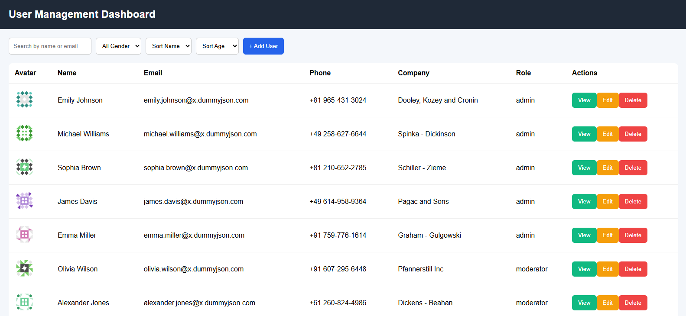
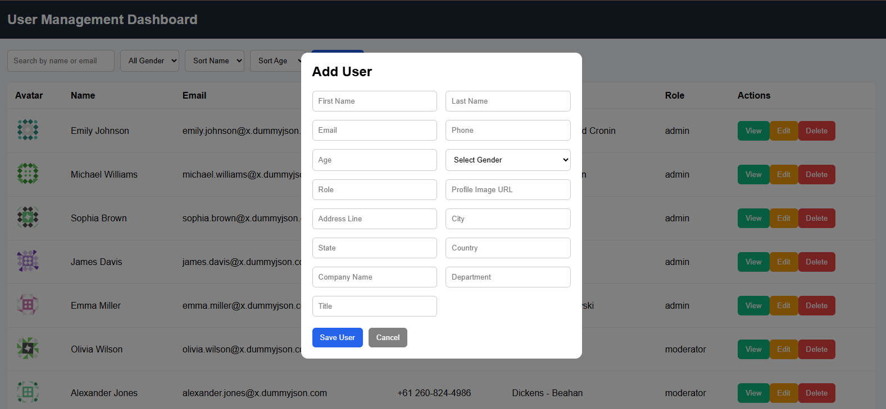
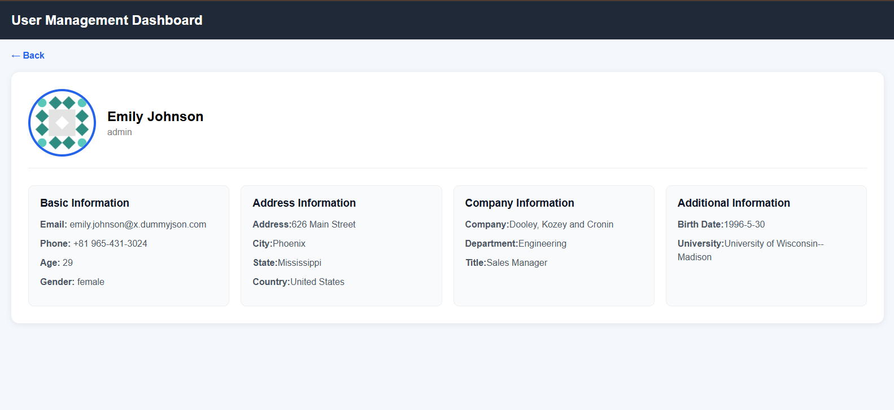

# User Management Dashboard

## demo link - https://practice-m76x.vercel.app/

A responsive React.js dashboard to manage users using DummyJSON API.

## Features

- View Users
- Search Users
- Filter by Gender
- Sort by Name & Age
- Add User
- Edit User
- Delete User
- User Details Page
- Responsive Design
- Pagination
- Loading & Error States

## Tech Stack

- React.js
- JavaScript (ES6+)
- React Router DOM
- Axios
- CSS

## images 

# Dashboard


# Add/Edit user 


# userDetails page


## API Used

https://dummyjson.com/users

## Run Project

```bash
git clone YOUR_GITHUB_REPO_LINK
cd user-management-dashboard
npm install
npm run dev ```

## folder structure

```
src/
 ├── Components/
 ├── Pages/
 ├── utils/
 ├── styles/
 ├── App.jsx
 └── main.jsx

```