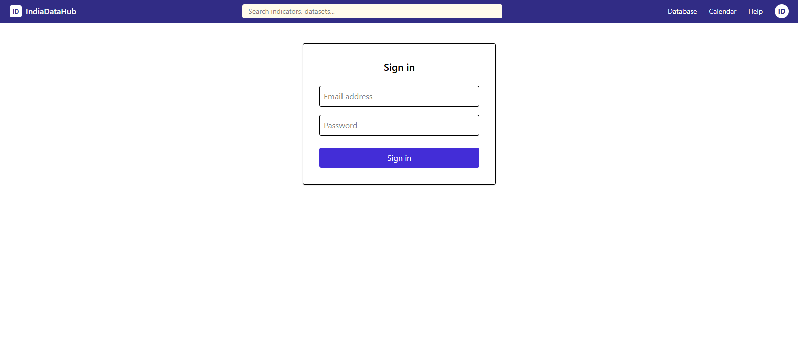
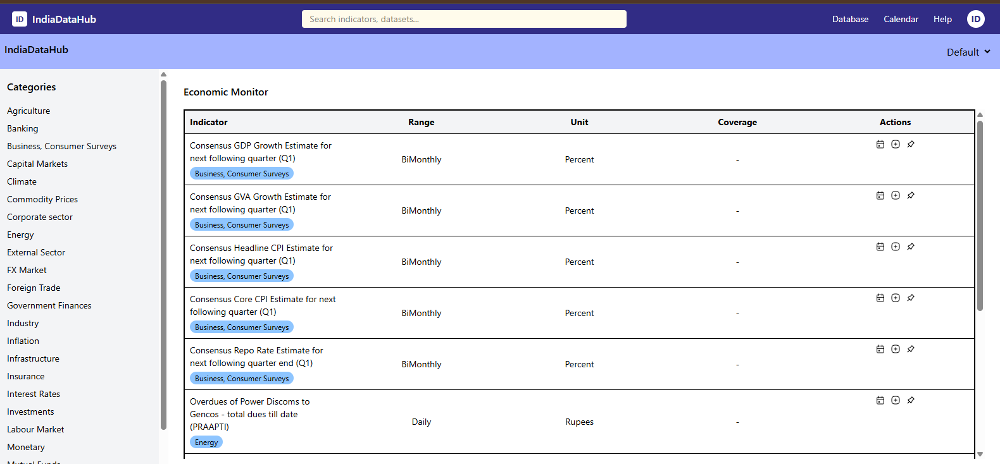
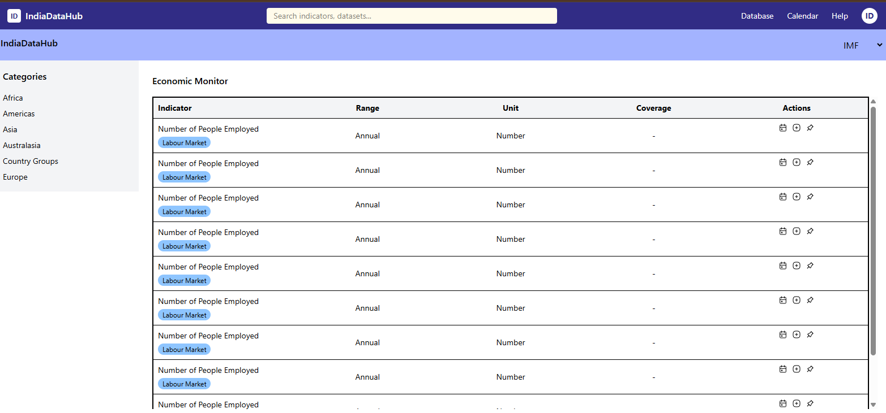

# India Data Hub – React Assignment

🔗 **Live Demo:-** https://practice-26q6.vercel.app/login  

This project is a sample **Product Catalogue Dashboard** built using **React.js** as part of an assignment.  
It demonstrates authentication flow, dynamic data rendering, pagination, and performance optimization for large datasets.

---

## 🚀 Features

### 1. Login Page
- Simple login UI as per the provided design.
- On successful login, user is redirected to the product catalogue page.

### 2. Product Catalogue Dashboard
- Layout similar to the provided “Results” image.
- **Left Sidebar**:
  - Displays dataset categories.
  - Data populated from `response1.json`.
- **Right Panel**:
  - Displays frequent datasets.
  - Data populated from `Frequent` key in the JSON.

### 3. Pagination
- Displays **10 records per page**.
- Improves readability and performance.
- Page navigation supported.

### 4. Dataset Switch (IMF)
- On selecting **IMF dataset**, data is loaded from `response2.json`.
- This dataset contains a large number of records.

### 5. Performance Optimization
To handle large datasets efficiently:
- Pagination implemented to limit DOM rendering.
- `useMemo` and `useCallback` used to avoid unnecessary re-renders.
- Optimized component structure to improve load time.

---

## 🛠️ Tech Stack

- **Frontend**: React.js 
- **Styling**: Tailwind CSS
- **State Management**: React Hooks
- **Data Source**: Static JSON files (`response1.json`, `response2.json`)

---

## screenshots

# Login page

# Dashboard page

---

## ▶️ Getting Started

### 1. Clone the Repository

git clone https://github.com/RuchiAgrawal9186/practice.git
cd reactjs/datamanage

### 2. Install Dependencies
npm install

### 3. Run the Application
npm run dev 
